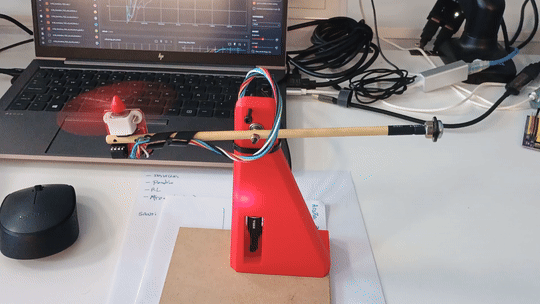

# Actuated Pendulum with Propeller

A robot designed for reinforcement learning and control experiments with real hardware.



# Repository Map

* **train.py**: training script for the robot.
* **hardware/**: 3D-printable models for the structure.
* **firmware/**: Arduino code for the ESP32 microcontroller.
* **test\_robot.py**: testing script for the robot.
* **env.py**: Gymnasium environment definition.
* **wrappers.py**: environment wrappers.

# Getting Started

## Hardware

### Bill of Materials

| Item                                      | Description                                                                                                                                                 |
| ----------------------------------------- | ----------------------------------------------------------------------------------------------------------------------------------------------------------- |
| ESP32 (Dev Kit C)                         | Microcontroller. Several board sizes are available on the market. We use the 25.70 × 53.40 mm version, but you may need to adapt the design for your board. |
| MG996R + propeller kit                    | Servo with motor, propeller, and controller.                                                                                                                |
| AS5600                                    | Rotary encoder.                                                                                                                                             |
| [3D-printed structure](hardware/body.stl) | Printed support structure.                                                                                                                                  |
| 2 × M3 locking nuts                       | Fasteners.                                                                                                                                                  |
| 2 × M3×25 screws                          | Fasteners.                                                                                                                                                  |
| 623z                                      | Bearing.                                                                                                                                                    |
| Flexible 4-wire cable                     | Electrical connection.                                                                                                                                      |
| Wooden or cardboard base                  | Base, approximately 120 × 100 mm.                                                                                                                           |
| Counterweight                              | It has to still fall when left alone, but helps the actuator lift the pendulum. A M6 bolt, washer and nut was used in our case.                                                                              |

### Assembly

* Connect the VCC pins of the MG996R and AS5600 to the 3.3 V pin on the ESP32.
* Connect all GND pins together, and w
* Connect the signal pins to the appropriate GPIOs on the ESP32 (as specified in *firmware.ino*).
* Glue the encoder magnet to the end of the screw that acts as the shaft.
* Some boards may require a small amount of glue to remain securely in place.


## Firmware

Upload the firmware to the ESP32 using the Arduino IDE.

## Usage

1. Install the required Python packages:

   ```bash
   pip install -r requirements.txt
   ```
2. Verify that everything is working by running:

   ```bash
   python test_robot.py
   ```

   The robot should move in a somewhat random manner.
3. Start training with:

   ```bash
   python train.py
   ```

# Reinforcement Learning

## History Wrapper

A history wrapper is used to maintain the last observations and actions taken by the agent.
This provides the agent with short-term memory and context, effectively restoring the Markov property of the environment. This is necessary because certain state variables (such as \$\dot{\theta}\$ or the propeller speed) are not directly observable from a single timestep.

## State-Space Representation

If we assume the propeller speed \$\omega\_p\$ is directly controllable (not entirely realistic), the system can be represented as:

$$
\mathbf{x} = \begin{bmatrix}\theta\\ \dot\theta\end{bmatrix},\qquad \omega_p = f(u).
$$

Dynamics:

$$
\dot{\mathbf{x}} =
\begin{bmatrix}
\dot\theta \\
\displaystyle \frac{1}{J}\Big( l\,c_T\,\omega_p^2 \;-\; m g l \sin\theta \;-\; b\,\dot\theta \Big)
\end{bmatrix}.
$$
